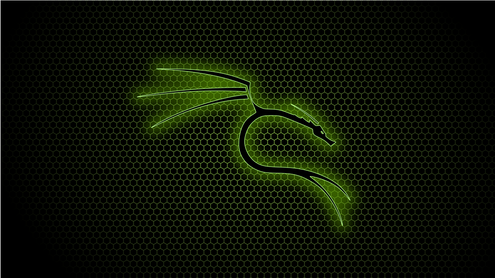

# About Me

I’m a passionate and detail-oriented Junior Cybersecurity Analyst. With hands-on experience in security analysis, threat detection, and incident response, I am eager to contribute to a robust security infrastructure. My goal is to leverage my skills and cloud security knowledge to protect digital assets in a Cybersecurity Analyst role.

## Experience 

Cybersecurity Intern

Protexxa, Cyber Nations

June 2024-Present

At Protexxa CyberNations, I immersed myself in the world of cybersecurity. From conducting vulnerability assessments to creating phishing workshops, I played a key role in enhancing our security posture. My work included researching best practices, collaborating with senior analysts, and providing actionable recommendations to improve client network security.

## Certifications

> CompTIA Security+ (Feb 2024)

> Microsoft AZ-900: Azure Fundamentals (Aug 2024)

> AWS Certified Cloud Practitioner (Expected Sep 2024)

> Microsoft SC-900: Security, Compliance, and Identity Fundamentals (Expected Oct 2024)

### Technical Skills

> **Security Tools**: SIEM (Wazuh), Wireshark, Nessus, Metasploit, Nmap

> **Cloud Platforms**: Microsoft Azure, AWS

> **Programming/Scripting**: Python, PowerShell, Bash

> **Operating Systems**: Windows, Linux (Ubuntu, Kali)

> **Networking**: TCP/IP, DNS, VPN, Firewall Configuration, Sigma Rule Creator

> **Vulnerability Management**: Penetration testing, vulnerability scanning

### Projects

**TryHackMe Advent of Cyber 2023**
> Completed 24/24 challenges in TryHackMe's Advent of Cyber on December 25th, 2023. Displaying a strong interest in challenging myself and broadening my horizons, I learned the core principles of:

> Penetration testing: Web application exploitation, and password cracking techniques.

> Security operations and engineering: Navigated a legacy system, learnt about DOS and its connection to the Windows Command Prompt and discovered the significance of file signatures and magic bytes in data recovery and file system analysis.

> Digital forensics and incident response: Analyzed digital artifacts and evidence, recovered deleted digital artifacts, and verified the integrity of a drive.

> Machine learning: AI chatbot prompt injection, used neural networks to predict anomalies, classification and training models, prepared the machine learning model, split the dataset into training and testing data, and evaluated the model's effectiveness.

> Malware analysis: Learned how to safely analyze malware samples, the fundamentals of .NET binaries, built a methodology for analyzing malware source code.

**Personal Cybersecurity Lab**
> In my home security lab I challenged myself to download and configure Wazuh. This will provide me with practical knowledge of configuration and how to operate a SIEM.

> After completing, this project taught me how to deploy a SIEM, monitor changes to files and the Windows registry, and detect unauthorized processes. Wazuh uses the MITRE ATT&CK, compliance, SCA, and security events to help protect devices and networks.

**Capture The Flag (CTF) Wargames**
> Mastered fundamental linux commands for navigating the filesystem, manipulating files and managing processes.

> Read and extracted specific information from files and handled compressed files.

> Performed port scans to identify potential vulnerabilities and connected to remote servers.

> Developed bash scripts to automate repetitive tasks and utilized setuid operations.

> Completed 33/33 levels, demonstrating strong problem-solving, technical skills, and a commitment to continuous learning.


### Scripting

```js
// Javascript code with syntax highlighting.
var fun = function lang(l) {
  dateformat.i18n = require('./lang/' + l)
  return true;
}
```

```ruby
# Ruby code with syntax highlighting
GitHubPages::Dependencies.gems.each do |gem, version|
  s.add_dependency(gem, "= #{version}")
end
```

#### Header 4

*   This is an unordered list following a header.
*   This is an unordered list following a header.
*   This is an unordered list following a header.

##### Header 5

1.  This is an ordered list following a header.
2.  This is an ordered list following a header.
3.  This is an ordered list following a header.

###### Header 6

| head1        | head two          | three |
|:-------------|:------------------|:------|
| ok           | good swedish fish | nice  |
| out of stock | good and plenty   | nice  |
| ok           | good `oreos`      | hmm   |
| ok           | good `zoute` drop | yumm  |

### There's a horizontal rule below this.

* * *

### Here is an unordered list:

*   Item foo
*   Item bar
*   Item baz
*   Item zip

### And an ordered list:

1.  Item one
1.  Item two
1.  Item three
1.  Item four

### And a nested list:

- level 1 item
  - level 2 item
  - level 2 item
    - level 3 item
    - level 3 item
- level 1 item
  - level 2 item
  - level 2 item
  - level 2 item
- level 1 item
  - level 2 item
  - level 2 item
- level 1 item

### Small image


### Large image




### Definition lists can be used with HTML syntax.

<dl>
<dt>Name</dt>
<dd>Ron-Pierre A. Walcott</dd>
<dt>Born</dt>
<dd>1999</dd>
<dt>Birthplace</dt>
<dd>Bridgetown</dd>
<dt>Visit me on</dt>
<a> href="https://www.linkedin.com/in/ron-pierre-walcott/"</a>

</dl>

```
Long, single-line code blocks should not wrap. They should horizontally scroll if they are too long. This line should be long enough to demonstrate this.
```

```
The final element.
```
